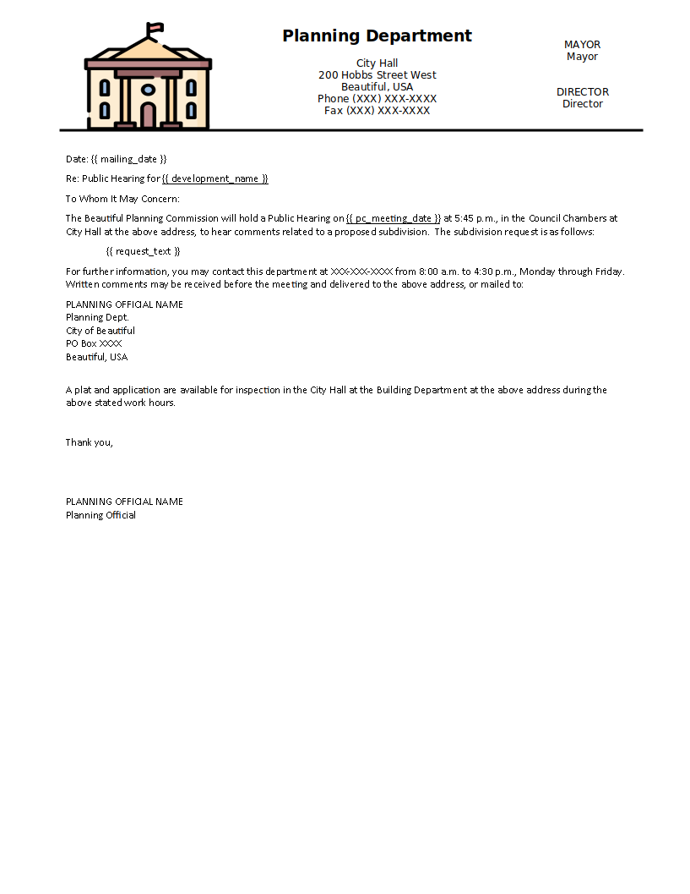
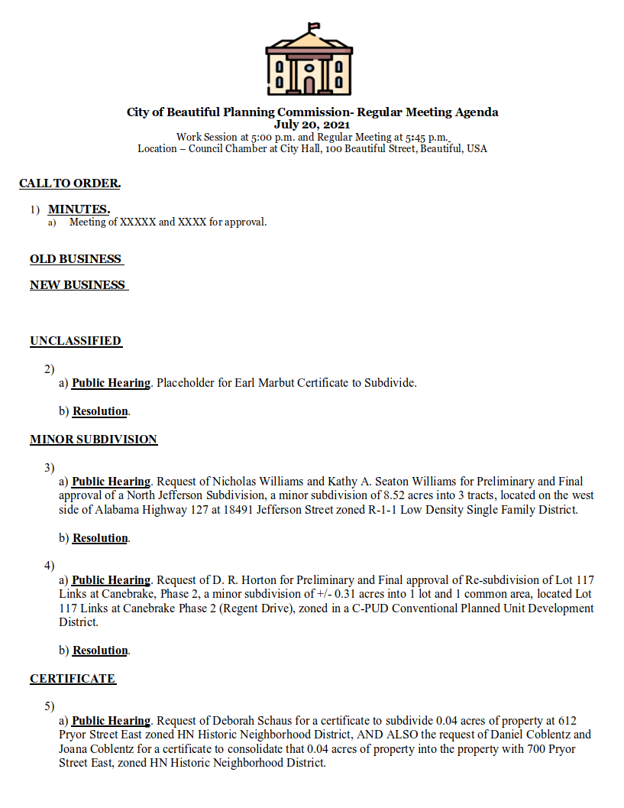
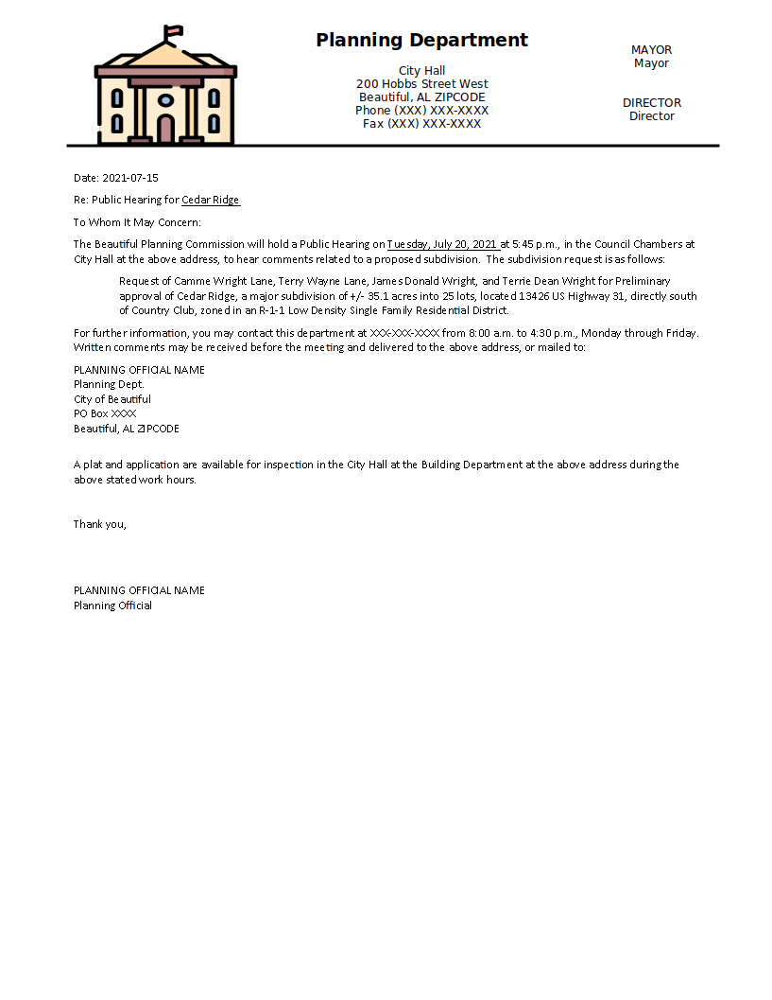

# Request Builder Py

This was a project that was under development from 2020 to August 2021, when I, Micah Cochran, worked for City of Athens.

[Screenshots](#Screenshots)
[Installation instructions](#Installation)

Software that generates agendas and notices from applicant requests.  This software is command line interface programmed in Python.

The `DATES` command tells you when those dates for meetings and deadlines for a given month. (Holidays are not taken into account.)  This works at any point in time.

`2023-08` is August 2023, for the Planning Commission Meeting that will take place in that month.  The software generates these date for any month.  For the command line dates are in ISO 8601 format, so `YYYY-MM-DD` format:

```
> python3 request_builder2.py 2023-08 DATES

Planning Commission dates for 2023-08
-----------------------------------------
Submittal Date                 2023-07-25
Departmental Review Team       2023-08-02
Newspaper Public Hearings Date 2023-08-05
Mailed Notice for Subdivisions 2023-08-10
Resubmittal Date               2023-08-11
Planning Commission Meeting    2023-08-15

```

Applicant requests are applications in PDF format.  The PDF files had named fields.  The software used those named fields within the PDF applications in order to generate descriptions of the items on the agenda. The descriptions are intended to be proofread, not flawless.  It is simple rule based templates for the descriptions that really did not adhere to strict grammar rules.  Descriptions could not be made from scanned or physical copies dropped off.  This software's intent was to speed up the process of creating agendas, but still requires an employee to proofread. 

The software is intended to be used in this order, just like the order of the process.
1. Applicants get their forms in by a specified turn in date (usually a Tuesday end of business day).
2. `DRT` - The Departmental Review Team (DRT) Agenda is generated by Thursday or Friday and was sent to departments for review with items for review.
3. `PCNEWS` - A list of public hearings to the newspaper for some of the items that go before the Planning Commision Meeting. (Some items have public hearings some do not, the software has the rules for that in its programming.)  Also this is posted outside of City Hall
4. `PCMAIL` - Some items require mailing regarding public hearing.
5. `PC` - Planning Commission (PC) Agenda is generated.

The help message shows:
```
> python3 request_builder2.py

Usage:
    C:\...> python3 request_builder2.py [date] [Report]

    [date]
        is in YYYY-MM format, so December 2020 is 2020-12
    Report is: 
        DATES - Prints out the meeting dates for a given month
        DRT  - Generate DRT Agenda
        PC  -  Generate Planning Commision Agenda
        PCNEWS - PC Public Hearings newspaper publication
        PCMAIL - Planning Commission Mailings
        ZNGANX - Set Public Hearings for Rezoning/Zoning/Annexation (Does NOT yet work.)
```

The software's purpose was to reduce the time between applicant submission and compiling the DRT Agenda.  This was to give the DRT team more time to review the items on the agenda.  The additional benefit of this software is to reduce the time it takes to create these documents, and reduce errors.

A REQUEST.TXT files in folders with applications is used to override the generated description or give a description that for a folder that would not otherwise have one.

The DRT folders have to start with number, so `1.` is the first item on the agenda.  This tells the software the order of the items on agendas.

For some items there was not a good description that could be gotten from the application.  PDF copy was a scan, or no form provided, and so on.  In those cases, the user could create a REQUEST.TXT file that it would use in place of the generated legal description. This overrides the action of using the PDF file to generate a legal description.

The templates are Word Documents (`.DOCX` format),  `python-docx` is the Python package that writes to this file format.  The benefit of this is that anyone who can use Word can modify the templates with a little instruction:

* Values surrounded by curly quotes are variables that will be replaced for the value for that template. So, for example {{ mailing_date }} will be replaced with a date for mailing a notice.
* You can move the location of the variables, the font, paragraph formatting, and text color, which will result in the replaced text having those same location, font, paragraph formatting, and text color.

Template for mailed notices:


Next step in the software development would have been UX improvements, add a GUI, database for the descriptions, and other Improvements to the software.  I left the City of Athens before those features could be added.

# Sample Data

A sample folder of data is provided courtesy of the City of Athens for `2021-07` (or July 2021).  Any questions about records during that time period should be directed to the City of Athens Engineering Services and Community Development Department.  This data is provided simply for software demonstration.

Since this data is from a different year, it will ask you to continue (type `y` + `Enter` to continue).  The software presumes that you would be running software on data from the same year.  This continue is a subtle way to let you know that you might have made a typo in the date.

# Screenshots

Planning Commission Agenda Screenshot

Note: This is still a rough agenda.  The certificate placeholder would need to be categorized.  Dates for minutes for approval would need to be added.

Screenshot of one of the generated mailed notices.



# Requirements
Python 3.6+

Python library requirements are in the [requirements.txt](requirements.txt)

# Installation
1. Create a Python environment.  I use venv because it is installed by default.  If you have Anaconda, you may want to deactivate it by running `conda deactivate`.

```
    > python -m venv venv
```

2. Activate the environment.

Under **Windows** run:
```
    # In cmd.exe
    venv\Scripts\activate.bat
    # In PowerShell
    venv\Scripts\Activate.ps1
```

Under Linux and MacOS run:
```
    $ source venv/bin/activate
```
This command is for POSIX compatible shells such as bash and zsh.  If you use other shells such as fish or csh you will need to use activate.fish or activate.csh instead.

3. Install requirement python libraries.
```
    > pip install -r requirements.txt
```

4. Change into the `request_builder/` folder.  Now, you can run the program itself wit
```
    > python request_builder2.py
```
# Changes

A few minor changes were made in August 2023 prior to upload this project to GitHub.

* Slight changes to make it work under Linux.   Mainly dealing with Windows filenames are a not case sensitive, but Linux requires case sensitivity.  In Linux, 'FILE.TXT' and 'file.txt' are different files names in Linux.
* Commented out code that had special templates for COVID related meetings, and removed the these templates.
* Templates were altered to replace City of Athens logos, mentions of City of Athens, City of Athens specific information, and to remove COVID procedures.
* Software will make a couple directories that don't exist.  This was not a problem in the original environment, but it is for this example.
* self.template was misspelling was corrected.

# Folders

* `DRT/` - Only contains the PDF application forms for submission to the DRT and REQUEST.TXT files.
* `templates/` - These are similar to the Template used for the City of Athens.  The logo has been replaced and information specific to Athens was removed.
* `images/` - images and screenshots

## Icon Attribution

Templates have been modified to remove City of Athens Logos and replace that with this logo.\
 [Town hall icons created by Freepik - Flaticon](https://www.flaticon.com/free-icons/town-hall)

